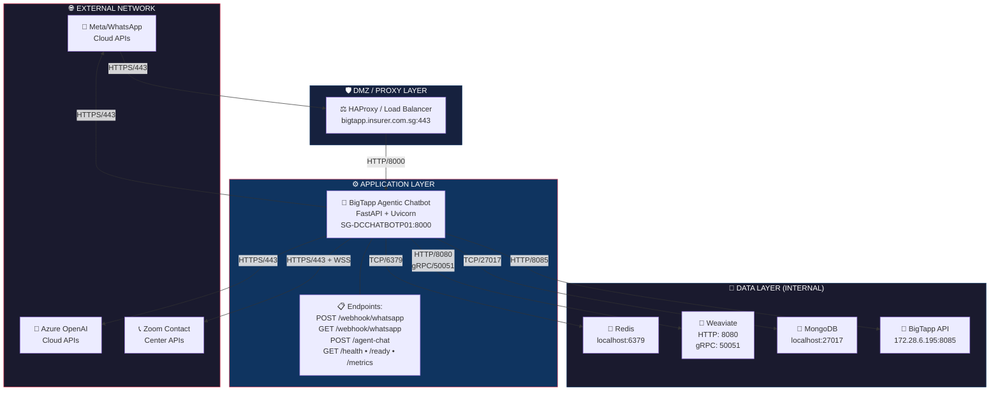
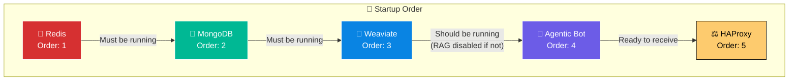

# BigTapp Agentic Chatbot - Infrastructure Requirements

> **Document Version:** 1.0  
> **Last Updated:** January 10, 2026  
> **Author:** Infrastructure Team  

---

## Table of Contents

1. [Executive Summary](#1-executive-summary)
2. [Server Specifications](#2-server-specifications)
3. [Network Matrix (Traffic Flows)](#3-network-matrix-traffic-flows)
4. [Firewall Rules](#4-firewall-rules)
5. [API Endpoints](#5-api-endpoints)
6. [Environment Variables](#6-environment-variables)
7. [Service Dependencies](#7-service-dependencies)
8. [Deployment Commands](#8-deployment-commands)

---

## 1. Executive Summary

The BigTapp Agentic Chatbot is a production-grade AI-powered insurance chatbot built with:

| Component | Technology |
|-----------|------------|
| **Framework** | FastAPI + Uvicorn (ASGI) |
| **AI/LLM** | Azure OpenAI (GPT-4.1-mini) |
| **Session Store** | Redis |
| **Vector DB** | Weaviate (RAG/Semantic Search) |
| **History Store** | MongoDB |
| **Messaging** | WhatsApp Business API (Meta) |
| **Live Agent** | Zoom Contact Center |
| **Backend API** | BigTapp Internal API |

---

## 2. Server Specifications

### 2.1 Production Server (Current)

| Specification | Value |
|---------------|-------|
| **Hostname** | `SG-DCCHATBOTP01` |
| **OS** | Ubuntu Server |
| **CPU** | 8 cores |
| **RAM** | 62 GB |
| **Recommended Workers** | 17 (`2 × CPU + 1`) |
| **Workload Type** | I/O-bound (LLM API calls) |

### 2.2 Minimum Requirements

| Component | Minimum | Recommended |
|-----------|---------|-------------|
| **CPU** | 4 cores | 8+ cores |
| **RAM** | 8 GB | 16+ GB |
| **Disk** | 50 GB SSD | 100+ GB SSD |
| **Python** | 3.10+ | 3.11+ |
| **Network** | 100 Mbps | 1 Gbps |

### 2.3 Capacity Estimates

| Metric | Estimate | Limiting Factor |
|--------|----------|-----------------|
| **Concurrent active requests** | ~50-100 | LLM API rate limits |
| **Concurrent chatting users** | 150-300 | LLM latency (~2-3s/turn) |
| **Total open sessions** | 10,000+ | Redis capacity |
| **Requests per minute** | 60-300 | Azure OpenAI RPM limits |

---

## 3. Network Matrix (Traffic Flows)

### 3.1 Complete Traffic Flow Diagram



### 3.2 Detailed Traffic Flow Table

| Flow ID | Source | Destination | Port(s) | Protocol | Direction | FQDN/IP | Description |
|---------|--------|-------------|---------|----------|-----------|---------|-------------|
| **F01** | Meta Webhook | Chatbot Server | 443 → 8000 | HTTPS/HTTP | Inbound | bigtapp.insurer.com.sg | WhatsApp webhook callbacks |
| **F02** | Chatbot Server | Meta Graph API | 443 | HTTPS | Outbound | graph.facebook.com | Send WhatsApp messages |
| **F03** | Chatbot Server | Azure OpenAI | 443 | HTTPS | Outbound | *.openai.azure.com | LLM API calls (chat, embeddings) |
| **F04** | Chatbot Server | Redis | 6379 | TCP | Internal | localhost / 127.0.0.1 | Session storage, rate limiting |
| **F05** | Chatbot Server | Weaviate HTTP | 8080 | HTTP | Internal | localhost / 127.0.0.1 | Vector search queries |
| **F06** | Chatbot Server | Weaviate gRPC | 50051 | gRPC | Internal | localhost / 127.0.0.1 | High-performance vector ops |
| **F07** | Chatbot Server | MongoDB | 27017 | TCP | Internal | localhost / 127.0.0.1 | Conversation history |
| **F08** | Chatbot Server | BigTapp Backend API | 8085 | HTTP | Internal | 172.28.6.195 | Customer validation, updates |
| **F09** | Chatbot Server | Zoom CCI API | 443 | HTTPS | Outbound | us01cciapi.zoom.us | Live agent handoff |
| **F10** | Chatbot Server | Zoom WebSocket | 443 | WSS | Outbound | ws.zoom.us | Live agent messaging |
| **F11** | Admin/Monitoring | Chatbot Server | 8000 | HTTP | Inbound | Internal IPs | Health checks, metrics |


### 3.3 FQDNs and Hostnames

#### External Services (Internet Access Required)

| Service | FQDN | IP (if static) | Purpose |
|---------|------|----------------|---------|
| **Meta WhatsApp API** | `graph.facebook.com` | Dynamic (CDN) | Send/receive WhatsApp messages |
| **Azure OpenAI** | `bigtapp-ai-chatbot.openai.azure.com` | Dynamic | GPT-4.1-mini, embeddings |
| **Azure OpenAI (Generic)** | `*.openai.azure.com` | Dynamic | All Azure OpenAI endpoints |
| **Zoom Contact Center** | `us01cciapi.zoom.us` | Dynamic | Live agent API |
| **Zoom CCI** | `us01cci.zoom.us` | Dynamic | Live chat messaging |

#### Internal Services (No Internet Required)

| Service | Hostname/IP | Port | Purpose |
|---------|-------------|------|---------|
| **Redis** | `localhost` / `127.0.0.1` | 6379 | Session cache, locks |
| **Weaviate HTTP** | `localhost` / `127.0.0.1` | 8080 | Vector search |
| **Weaviate gRPC** | `localhost` / `127.0.0.1` | 50051 | Vector operations |
| **MongoDB** | `localhost` / `127.0.0.1` | 27017 | History storage |
| **BigTapp Backend API** | `172.28.6.195` | 8085 | Policy/customer data |

---

## 4. Firewall Rules

### 4.1 Inbound Rules (To Chatbot Server)

| Rule ID | Source | Destination | Port | Protocol | Action | Description |
|---------|--------|-------------|------|----------|--------|-------------|
| **IN-01** | `0.0.0.0/0` (via HAProxy) | Chatbot Server | 8000 | TCP | ALLOW | WhatsApp webhooks (via reverse proxy) |
| **IN-02** | Internal Admin IPs | Chatbot Server | 8000 | TCP | ALLOW | Direct admin access, health checks |
| **IN-03** | Monitoring Server | Chatbot Server | 8000 | TCP | ALLOW | Prometheus metrics scraping |
| **IN-04** | HAProxy/LB | Chatbot Server | 8000 | TCP | ALLOW | Load balancer health probes |
| **IN-05** | `*` | Chatbot Server | 22 | TCP | ALLOW (Restricted) | SSH access (limit to admin IPs) |
| **IN-06** | `*` | Chatbot Server | `*` | `*` | DENY | Default deny all other inbound |

### 4.2 Outbound Rules (From Chatbot Server)

| Rule ID | Source | Destination | Port | Protocol | Action | Description |
|---------|--------|-------------|------|----------|--------|-------------|
| **OUT-01** | Chatbot Server | `graph.facebook.com` | 443 | TCP | ALLOW | Meta WhatsApp API |
| **OUT-02** | Chatbot Server | `*.openai.azure.com` | 443 | TCP | ALLOW | Azure OpenAI API |
| **OUT-03** | Chatbot Server | `us01cciapi.zoom.us` | 443 | TCP | ALLOW | Zoom Contact Center API |
| **OUT-04** | Chatbot Server | `us01cci.zoom.us` | 443 | TCP | ALLOW | Zoom live chat |
| **OUT-05** | Chatbot Server | `*.zoom.us` | 443 | TCP | ALLOW | Zoom WebSocket connections |

| **OUT-07** | Chatbot Server | `localhost` | 6379 | TCP | ALLOW | Redis (local) |
| **OUT-08** | Chatbot Server | `localhost` | 8080 | TCP | ALLOW | Weaviate HTTP (local) |
| **OUT-09** | Chatbot Server | `localhost` | 50051 | TCP | ALLOW | Weaviate gRPC (local) |
| **OUT-10** | Chatbot Server | `localhost` | 27017 | TCP | ALLOW | MongoDB (local) |
| **OUT-11** | Chatbot Server | `172.28.6.195` | 8085 | TCP | ALLOW | BigTapp Backend API |
| **OUT-12** | Chatbot Server | DNS Servers | 53 | UDP/TCP | ALLOW | DNS resolution |
| **OUT-13** | Chatbot Server | NTP Servers | 123 | UDP | ALLOW | Time synchronization |
| **OUT-14** | Chatbot Server | `*` | `*` | `*` | DENY | Default deny all other outbound |

### 4.3 Internal Network Rules (Between Services)

| Rule ID | Source | Destination | Port | Protocol | Action | Description |
|---------|--------|-------------|------|----------|--------|-------------|
| **INT-01** | Chatbot Server | BigTapp API Server | 8085 | TCP | ALLOW | Customer validation/updates |
| **INT-02** | BigTapp API Server | Chatbot Server | 8000 | TCP | DENY | No callback needed |
| **INT-03** | Admin Network | Chatbot Server | 8000, 22 | TCP | ALLOW | Management access |

### 4.4 Meta WhatsApp Webhook IP Whitelist

For enhanced security, allow only Meta's webhook IPs:

```
# Meta/Facebook IP Ranges for Webhooks (verify current list)
# These IPs should be allowed through HAProxy/External Firewall

157.240.0.0/16
31.13.24.0/21
31.13.64.0/18
66.220.144.0/20
69.63.176.0/20
69.171.224.0/19
74.119.76.0/22
129.134.0.0/16
157.240.0.0/16
173.252.64.0/18
179.60.192.0/22
185.60.216.0/22
204.15.20.0/22
```

---

## 5. API Endpoints

### 5.1 Chatbot Server Endpoints (Exposed)

| Method | Path | Auth | Description | Request Body | Response |
|--------|------|------|-------------|--------------|----------|
| **GET** | `/health` | None | Health check | None | `{"status": "healthy", "service": "bigtapp-agentic", "version": "1.0.0"}` |
| **GET** | `/ready` | None | Readiness probe | None | `{"ready": true, "checks": {...}}` |
| **GET** | `/metrics` | None | Prometheus metrics | None | Prometheus format text |
| **POST** | `/agent-chat` | None | Chat endpoint | `{"session_id": "...", "message": "..."}` | `{"response": "...", "sources": "...", "debug_state": {...}}` |
| **GET** | `/webhook/whatsapp` | Query params | Meta webhook verification | URL params: `hub.mode`, `hub.verify_token`, `hub.challenge` | Challenge string |
| **POST** | `/webhook/whatsapp` | Signature header | WhatsApp message handler | Meta webhook payload | `{"status": "ok"}` |
| **POST** | `/session/reset/{session_id}` | None | Reset session | None | `{"status": "ok", "message": "..."}` |
| **GET** | `/session/{session_id}` | X-Admin-Key header | Get session state (debug) | None | `{"status": "ok", "session": {...}}` |

### 5.2 BigTapp Backend API Endpoints (Internal)

| Method | Path | Description | Request Body | Response |
|--------|------|-------------|--------------|----------|
| **POST** | `/api/v1/customer/validate` | Validate customer identity | `{"nricFin": "...", "firstName": "...", "lastName": "...", "mobileNo": "...", "policyNo": "..."}` | Customer data + policies |
| **GET** | `/api/v1/claim/list/{nric}` | Get claims by NRIC | None | List of claims |
| **GET** | `/api/v1/chatbot/policies?nric={nric}` | Get policies by NRIC | None | List of policies |
| **GET** | `/api/v1/policies/{policyNo}` | Get policy details | None | Policy details |
| **POST** | `/api/v1/customer/update` | Update customer details | `{"nric": "...", "updateType": "...", "updateRequest": {...}}` | Update result |
| **POST** | `/api/v1/home-protect-insured-address/update` | Update insured address | `{"policyNo": "...", "updateRequest": {...}}` | Update result |
| **GET** | `/api/v1/postalCode/{postalCode}` | Get address from postal code | None | Address details |

#### Update Types for `/api/v1/customer/update`:

| Update Type | Fields in `updateRequest` |
|-------------|---------------------------|
| `email_change` | `{"email": "new@email.com"}` |
| `mobile_change` | `{"mobile": "91234567"}` |
| `address_change` | `{"postalCode": "...", "unitNo": "...", "houseNo": "...", "streetName": "...", "buildingName": "..."}` |
| `payment_info_change` | `{"cardNo": "...", "cardExpire": "...", "creditCardType": "...", "policyNo": "...", "payerSurname": "...", "payerGivenName": "...", "payerIDCardNumber": "..."}` |

### 5.3 External API Endpoints (Outbound)

#### Azure OpenAI

| Method | Endpoint | Description |
|--------|----------|-------------|
| **POST** | `https://{resource}.openai.azure.com/openai/deployments/{deployment}/chat/completions?api-version={version}` | Chat completions |
| **POST** | `https://{resource}.openai.azure.com/openai/deployments/{deployment}/embeddings?api-version={version}` | Text embeddings |

#### Meta WhatsApp Business API

| Method | Endpoint | Description |
|--------|----------|-------------|
| **POST** | `https://graph.facebook.com/v18.0/{phone_number_id}/messages` | Send message |
| **GET** | `https://graph.facebook.com/v18.0/{phone_number_id}` | Get phone number info |

#### Zoom Contact Center

| Method | Endpoint | Description |
|--------|----------|-------------|
| **POST** | `https://us01cciapi.zoom.us/v1/auth/token/generate/in/visitor/mode` | Get auth token |
| **POST** | `https://us01cciapi.zoom.us/v1/livechat/customer/incoming` | Initiate engagement |
| **POST** | `https://us01cciapi.zoom.us/v1/livechat/customer/connected` | Connection acknowledgement |
| **POST** | `https://us01cci.zoom.us/v1/livechat/message/send` | Send message to agent |
| **WSS** | `wss://*.zoom.us/...` | WebSocket for real-time messaging |

---

## 6. Environment Variables

### 6.1 Required Variables

```bash
# ============================================
# AZURE OPENAI (Required)
# ============================================
AZURE_OPENAI_ENDPOINT=https://bigtapp-ai-chatbot.openai.azure.com/
AZURE_OPENAI_API_KEY=<api-key>
AZURE_OPENAI_API_VERSION=2024-02-15-preview
AZURE_OPENAI_CHAT_DEPLOYMENT_NAME=gpt-4.1-mini
AZURE_OPENAI_RESPONSE_DEPLOYMENT_NAME=gpt-4.1-mini
AZURE_OPENAI_EMBEDDING_DEPLOYMENT_NAME=text-embedding-3-large
AZURE_OPENAI_TEMPERATURE=0.2
AZURE_OPENAI_RESPONSE_TEMPERATURE=0.3

# ============================================
# REDIS (Required)
# ============================================
REDIS_URL=redis://localhost:6379/0
AGENTIC_SESSION_TTL_SECONDS=900
AGENTIC_USE_REDIS_CHECKPOINTER=true
RL_WINDOW_SECONDS=60
RL_MAX_MESSAGES=10
DEDUPE_TTL_SECONDS=86400

# ============================================
# MONGODB (Required)
# ============================================
MONGO_URI=mongodb://localhost:27017
DB_NAME=bigtapp
AGENTIC_HISTORY_COLLECTION=agentic_conversation_history

# ============================================
# WEAVIATE (Required for RAG)
# ============================================
WEAVIATE_URL=http://localhost:8080
WEAVIATE_API_KEY=
WEAVIATE_GRPC_PORT=50051

# ============================================
# WHATSAPP / META (Required for WhatsApp)
# ============================================
META_VERIFY_TOKEN=<verify-token>
META_ACCESS_TOKEN=<access-token>
META_PHONE_NUMBER_ID=<phone-number-id>
# META_APP_SECRET=<app-secret>  # Optional for signature verification

# ============================================
# BigTapp BACKEND API (Required)
# ============================================
BigTapp_API_BASE_URL=http://172.28.6.195:8085
BigTapp_API_TIMEOUT=30.0
BigTapp_API_UPDATE_TIMEOUT=60.0
# BigTapp_API_LOG_PII=false  # Set to true for debugging only
```

### 6.2 Optional Variables

```bash
# ============================================
# ZOOM CONTACT CENTER (Optional)
# ============================================
ZOOM_BASE_URL=https://us01cciapi.zoom.us
ZOOM_API_KEY=<api-key>
ZOOM_SDK_RESOURCE=<sdk-resource>

# ============================================
# IDLE SESSION MONITOR
# ============================================
ENABLE_IDLE_FAREWELL=false
IDLE_FAREWELL_SECONDS=900
IDLE_MONITOR_POLL_SECONDS=60

# ============================================
# PERFORMANCE TUNING
# ============================================
AGENTIC_HTTP_POOL_SIZE=100
AGENTIC_HTTP_TIMEOUT=30.0
CHAT_TIMEOUT_SECONDS=60.0

# ============================================
# LOGGING
# ============================================
LOG_LEVEL=INFO

# ============================================
# CORS
# ============================================
CORS_ORIGINS=*

# ============================================
# ADMIN
# ============================================
ADMIN_API_KEY=<admin-key>

# ============================================
# LLM PROVIDER
# ============================================
LLM_PROVIDER=azure
```

---

## 7. Service Dependencies

### 7.1 Dependency Matrix

| Service | Required | Port | Health Check | Startup Order |
|---------|----------|------|--------------|---------------|
| **Redis** | ✅ Yes | 6379 | `PING` command | 1 (First) |
| **MongoDB** | ✅ Yes | 27017 | `admin.command("ping")` | 2 |
| **Weaviate** | ✅ Yes | 8080, 50051 | HTTP `/v1/.well-known/ready` | 3 |
| **BigTapp API** | ✅ Yes | 8085 | N/A (on-demand) | N/A |
| **Azure OpenAI** | ✅ Yes | 443 | N/A (on-demand) | N/A |
| **Meta WhatsApp** | ✅ Yes | 443 | N/A (on-demand) | N/A |
| **Zoom CCI** | ✅ Yes | 443 | N/A (on-demand) | N/A |

### 7.2 Startup Sequence



### 7.3 Failure Modes

| Dependency | Failure Impact | Fallback |
|------------|----------------|----------|
| **Redis** | FATAL - App cannot start | None (critical) |
| **MongoDB** | History not persisted | Logs warning, continues |
| **Weaviate** | RAG/knowledge disabled - degraded responses | None (critical for quality) |
| **BigTapp API** | Policy services fail | Shows error to user |
| **Azure OpenAI** | All LLM features fail | Returns error message |
| **Meta WhatsApp** | WhatsApp messages fail | Retries with backoff |
| **Zoom CCI** | Live agent handoff fails | Shows error to user |

---

## 8. Deployment Commands

### 8.1 Production Deployment

```bash
# Navigate to application directory
cd ~/agentic

# Activate virtual environment
source venv/bin/activate

# Pull latest code
git pull origin main

# Install/update dependencies
pip install -r requirements.txt

# Run with recommended workers
python -m uvicorn main:app --host 0.0.0.0 --port 8000 --workers 17
```

### 8.2 Systemd Service (Recommended)

Create `/etc/systemd/system/agentic.service`:

```ini
[Unit]
Description=BigTapp Agentic Chatbot
After=network.target redis.service mongodb.service

[Service]
Type=simple
User=vendor
Group=vendor
WorkingDirectory=/home/vendor/agentic
Environment="PATH=/home/vendor/agentic/venv/bin"
EnvironmentFile=/home/vendor/agentic/.env
ExecStart=/home/vendor/agentic/venv/bin/python -m uvicorn main:app --host 0.0.0.0 --port 8000 --workers 17
Restart=always
RestartSec=10
StandardOutput=append:/home/vendor/agentic/logs/app.log
StandardError=append:/home/vendor/agentic/logs/error.log

[Install]
WantedBy=multi-user.target
```

Commands:
```bash
sudo systemctl daemon-reload
sudo systemctl enable agentic
sudo systemctl start agentic
sudo systemctl status agentic
```

### 8.3 Health Check Commands

```bash
# Basic health check
curl http://localhost:8000/health

# Readiness check (verifies Redis, LLM, Weaviate)
curl http://localhost:8000/ready

# Prometheus metrics
curl http://localhost:8000/metrics
```

### 8.4 Log Monitoring

```bash
# Application logs
tail -f ~/agentic/logs/app.log

# Error logs
tail -f ~/agentic/logs/error.log

# Filter for API errors
grep "API_TIMEOUT\|API_ERROR\|API_CONNECT_ERROR" ~/agentic/logs/app.log
```

---

## Appendix A: Quick Reference Card

### Ports Summary

| Port | Service | Protocol | Direction |
|------|---------|----------|-----------|
| 8000 | Agentic Bot | HTTP | Inbound |
| 443 | External APIs | HTTPS | Outbound |
| 6379 | Redis | TCP | Localhost |
| 8080 | Weaviate HTTP | HTTP | Localhost |
| 50051 | Weaviate gRPC | gRPC | Localhost |
| 27017 | MongoDB | TCP | Localhost |
| 8085 | BigTapp API | HTTP | Internal |

### Critical FQDNs (Must Allow Outbound)

```
graph.facebook.com              # WhatsApp API
*.openai.azure.com              # Azure OpenAI
us01cciapi.zoom.us              # Zoom Contact Center
us01cci.zoom.us                 # Zoom Live Chat
```

### Internal IPs

```
172.28.6.195:8085               # BigTapp Backend API
127.0.0.1:6379                  # Redis
127.0.0.1:8080                  # Weaviate HTTP
127.0.0.1:50051                 # Weaviate gRPC
127.0.0.1:27017                 # MongoDB
```

---

**Document End**
